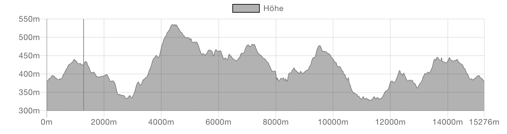

# Jupyter Demo
Norah Smith
2021-05-22

# This is a test notebook.

Lorem ipsum dolor sit amet, consectetur adipiscing elit. Praesent in
odio lorem. Duis id sodales tellus. In ac rutrum massa, non venenatis
metus. Nunc condimentum sem et libero lobortis, ac tristique odio
molestie. Vivamus consectetur libero mi, at rutrum lorem tempor nec.
Duis diam felis, pretium eget pulvinar at, efficitur vel dui. Aenean
libero enim, auctor quis lorem vel, ullamcorper suscipit lacus. Fusce
non mauris urna. Praesent non accumsan felis. Etiam tellus dui, lobortis
quis tempus at, varius ut nisi. Praesent ut molestie mauris. Aliquam
sagittis tristique orci eget consequat. Nunc congue purus rutrum,
lacinia sapien et, mattis felis. Nullam malesuada augue eget est luctus
fringilla quis non tellus. Nulla laoreet vulputate semper. Nullam vel
fermentum lorem.

Nunc ullamcorper bibendum rhoncus. Phasellus eget pulvinar odio. Vivamus
semper turpis blandit dictum condimentum. In dictum arcu risus, a
gravida justo consequat id. Mauris vel eros mattis diam viverra euismod
sed eget lectus. Orci varius natoque penatibus et magnis dis parturient
montes, nascetur ridiculus mus. Praesent ullamcorper congue nulla, et
luctus leo feugiat at.


Nam arcu dolor, ullamcorper nec ipsum eu, aliquam varius tellus. Nullam
a dolor tellus. Nunc elit nulla, vestibulum id cursus et, ultricies eu
metus. Interdum et malesuada fames ac ante ipsum primis in faucibus.
Donec congue varius nibh facilisis sollicitudin. Praesent venenatis ut
leo dapibus tincidunt. Maecenas mattis imperdiet libero in pharetra.

Nullam ac felis eget metus congue auctor. Pellentesque habitant morbi
tristique senectus et netus et malesuada fames ac turpis egestas. Donec
pretium enim sit amet sapien eleifend posuere. Suspendisse ut dictum
sem. In malesuada fermentum leo eu egestas. Mauris lobortis, nulla non
auctor tempor, purus ex tincidunt sapien, sed tristique metus erat eget
metus. Pellentesque mattis finibus arcu non mollis. Donec convallis
ullamcorper risus, sit amet ultricies lacus vulputate sed. Mauris quis
accumsan eros, eget lobortis mi. Vivamus id leo odio. Suspendisse
ultricies suscipit magna laoreet aliquam. Ut interdum nulla quis egestas
tempus. Suspendisse at lorem ac lorem sollicitudin suscipit ac quis
ligula.

``` python
# this is some python code

a = 5
b = 6
a+b
```

    11

Nullam ac felis eget metus congue auctor. Pellentesque habitant morbi
tristique senectus et netus et malesuada fames ac turpis egestas. Donec
pretium enim sit amet sapien eleifend posuere. Suspendisse ut dictum
sem. In malesuada fermentum leo eu egestas. Mauris lobortis, nulla non
auctor tempor, purus ex tincidunt sapien, sed tristique metus erat eget
metus. Pellentesque mattis finibus arcu non mollis. Donec convallis
ullamcorper risus, sit amet ultricies lacus vulputate sed. Mauris quis
accumsan eros, eget lobortis mi. Vivamus id leo odio. Suspendisse
ultricies suscipit magna laoreet aliquam. Ut interdum nulla quis egestas
tempus. Suspendisse at lorem ac lorem sollicitudin suscipit ac quis
ligula.



Nullam ac felis eget metus congue auctor. Pellentesque habitant morbi
tristique senectus et netus et malesuada fames ac turpis egestas. Donec
pretium enim sit amet sapien eleifend posuere. Suspendisse ut dictum
sem. In malesuada fermentum leo eu egestas. Mauris lobortis, nulla non
auctor tempor, purus ex tincidunt sapien, sed tristique metus erat eget
metus. Pellentesque mattis finibus arcu non mollis. Donec convallis
ullamcorper risus, sit amet ultricies lacus vulputate sed. Mauris quis
accumsan eros, eget lobortis mi. Vivamus id leo odio. Suspendisse
ultricies suscipit magna laoreet aliquam. Ut interdum nulla quis egestas
tempus. Suspendisse at lorem ac lorem sollicitudin suscipit ac quis
ligula.

## Test 2

Nullam ac felis eget metus congue auctor. Pellentesque habitant morbi
tristique senectus et netus et malesuada fames ac turpis egestas. Donec
pretium enim sit amet sapien eleifend posuere. Suspendisse ut dictum
sem. In malesuada fermentum leo eu egestas. Mauris lobortis, nulla non
auctor tempor, purus ex tincidunt sapien, sed tristique metus erat eget
metus. Pellentesque mattis finibus arcu non mollis. Donec convallis
ullamcorper risus, sit amet ultricies lacus vulputate sed. Mauris quis
accumsan eros, eget lobortis mi. Vivamus id leo odio. Suspendisse
ultricies suscipit magna laoreet aliquam. Ut interdum nulla quis egestas
tempus. Suspendisse at lorem ac lorem sollicitudin suscipit ac quis
ligula.


Nam arcu dolor, ullamcorper nec ipsum eu, aliquam varius tellus. Nullam
a dolor tellus. Nunc elit nulla, vestibulum id cursus et, ultricies eu
metus. Interdum et malesuada fames ac ante ipsum primis in faucibus.
Donec congue varius nibh facilisis sollicitudin. Praesent venenatis ut
leo dapibus tincidunt. Maecenas mattis imperdiet libero in pharetra.

``` python
import math
import random
from textwrap import fill

def generate_report(sections=5, lines_per_section=5):
    print("=== Synthetic Notebook Output ===\n")

    for s in range(1, sections + 1):
        print(f"--- Section {s} ---\n")

        for i in range(lines_per_section):
            value = math.sin(i / 5) + random.random()
            paragraph = (
                f"Line {i:03d}: "
                f"The computed value is {value:.6f}. "
                "This line exists solely to create long, realistic-looking "
                "output for testing notebook rendering, scrolling behavior, "
                "and code folding in static site generators."
            )
            print(fill(paragraph, width=80))

        print("\n")

generate_report()
```

    === Synthetic Notebook Output ===

    --- Section 1 ---

    Line 000: The computed value is 0.362232. This line exists solely to create
    long, realistic-looking output for testing notebook rendering, scrolling
    behavior, and code folding in static site generators.
    Line 001: The computed value is 0.766116. This line exists solely to create
    long, realistic-looking output for testing notebook rendering, scrolling
    behavior, and code folding in static site generators.
    Line 002: The computed value is 0.614774. This line exists solely to create
    long, realistic-looking output for testing notebook rendering, scrolling
    behavior, and code folding in static site generators.
    Line 003: The computed value is 0.967099. This line exists solely to create
    long, realistic-looking output for testing notebook rendering, scrolling
    behavior, and code folding in static site generators.
    Line 004: The computed value is 1.694689. This line exists solely to create
    long, realistic-looking output for testing notebook rendering, scrolling
    behavior, and code folding in static site generators.


    --- Section 2 ---

    Line 000: The computed value is 0.610526. This line exists solely to create
    long, realistic-looking output for testing notebook rendering, scrolling
    behavior, and code folding in static site generators.
    Line 001: The computed value is 0.596220. This line exists solely to create
    long, realistic-looking output for testing notebook rendering, scrolling
    behavior, and code folding in static site generators.
    Line 002: The computed value is 1.167077. This line exists solely to create
    long, realistic-looking output for testing notebook rendering, scrolling
    behavior, and code folding in static site generators.
    Line 003: The computed value is 0.857719. This line exists solely to create
    long, realistic-looking output for testing notebook rendering, scrolling
    behavior, and code folding in static site generators.
    Line 004: The computed value is 0.994754. This line exists solely to create
    long, realistic-looking output for testing notebook rendering, scrolling
    behavior, and code folding in static site generators.


    --- Section 3 ---

    Line 000: The computed value is 0.938109. This line exists solely to create
    long, realistic-looking output for testing notebook rendering, scrolling
    behavior, and code folding in static site generators.
    Line 001: The computed value is 0.836715. This line exists solely to create
    long, realistic-looking output for testing notebook rendering, scrolling
    behavior, and code folding in static site generators.
    Line 002: The computed value is 0.632244. This line exists solely to create
    long, realistic-looking output for testing notebook rendering, scrolling
    behavior, and code folding in static site generators.
    Line 003: The computed value is 1.224329. This line exists solely to create
    long, realistic-looking output for testing notebook rendering, scrolling
    behavior, and code folding in static site generators.
    Line 004: The computed value is 1.252412. This line exists solely to create
    long, realistic-looking output for testing notebook rendering, scrolling
    behavior, and code folding in static site generators.


    --- Section 4 ---

    Line 000: The computed value is 0.165712. This line exists solely to create
    long, realistic-looking output for testing notebook rendering, scrolling
    behavior, and code folding in static site generators.
    Line 001: The computed value is 0.848766. This line exists solely to create
    long, realistic-looking output for testing notebook rendering, scrolling
    behavior, and code folding in static site generators.
    Line 002: The computed value is 1.312737. This line exists solely to create
    long, realistic-looking output for testing notebook rendering, scrolling
    behavior, and code folding in static site generators.
    Line 003: The computed value is 1.419304. This line exists solely to create
    long, realistic-looking output for testing notebook rendering, scrolling
    behavior, and code folding in static site generators.
    Line 004: The computed value is 1.324013. This line exists solely to create
    long, realistic-looking output for testing notebook rendering, scrolling
    behavior, and code folding in static site generators.


    --- Section 5 ---

    Line 000: The computed value is 0.283609. This line exists solely to create
    long, realistic-looking output for testing notebook rendering, scrolling
    behavior, and code folding in static site generators.
    Line 001: The computed value is 0.485171. This line exists solely to create
    long, realistic-looking output for testing notebook rendering, scrolling
    behavior, and code folding in static site generators.
    Line 002: The computed value is 0.613399. This line exists solely to create
    long, realistic-looking output for testing notebook rendering, scrolling
    behavior, and code folding in static site generators.
    Line 003: The computed value is 0.635908. This line exists solely to create
    long, realistic-looking output for testing notebook rendering, scrolling
    behavior, and code folding in static site generators.
    Line 004: The computed value is 1.137982. This line exists solely to create
    long, realistic-looking output for testing notebook rendering, scrolling
    behavior, and code folding in static site generators.
